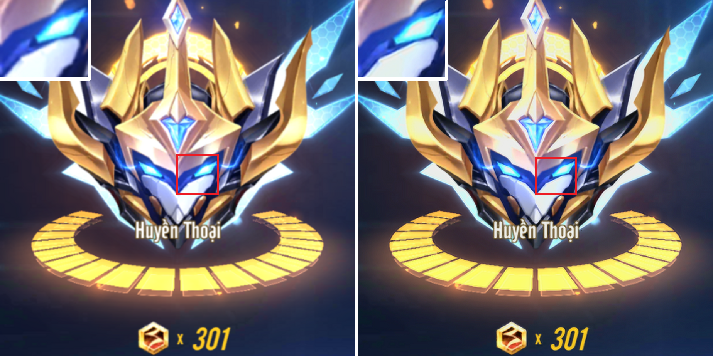

# [TensorFlow] Super-Resolution CNN

Implementation of SRCNN model in **Image Super-Resolution using Deep Convolutional Network** paper with Tensorflow 2x. 

I used Adam with optimize tuned hyperparameters instead of SGD + Momentum. 

I implemented 3 models in the paper, SRCNN-915, SRCNN-935, SRCNN-955.


## Contents
- [Train](#train)
- [Demo](#demo)
- [References](#references)


## Train
You run this command to begin the training:
```
python train.py  --steps=1000000                   \
                 --architecture="915"              \
                 --batch_size=128                  \
                 --save-best-only=1                \
                 --save-every=1000                 \
                 --ckpt-dir="checkpoint/SRCNN915"  
```
- **architecture** accepts 3 values: 915, 935, 955. They are orders of kernel size.
- **save-best-only**: if it is **0**, model weights will be saved every **save-every** steps.


**NOTE**: if you want to re-train a new model, you should delete all files in sub-directories in **checkpoint** directory. Your checkpoint will be saved when above command finishs and can be used for the next times, so you can train a model on Google Colab without taking care of GPU time limit.

I trained 3 models on Google Colab in 1000000 steps: [](https://colab.research.google.com/drive/1VtHu3DCMs_qnc4d9_HpNx2g2xX5SriUZ?usp=sharing)

You can get the models here:
- [SRCNN-915.h5](checkpoint/SRCNN915/SRCNN-915.h5)
- [SRCNN-935.h5](checkpoint/SRCNN935/SRCNN-935.h5)
- [SRCNN-955.h5](checkpoint/SRCNN955/SRCNN-955.h5)


## Demo 
After Training, you can test models with this command, the result is the **sr.png**.
```
python demo.py --image-path="dataset/test2.png"                \
               --architecture="915"                            \
               --ckpt-path="checkpoint/SRCNN915/SRCNN-915.h5"  \
               --scale=2
```

I evaluated models with Set5, Set14, BSD100 and Urban100 dataset by PSNR:

<div align="center">

|   Model   | Set5 x2 | Set5 x3 | Set5 x4 | Set14 x2 | Set14 x3 | Set14 x4 | BSD100 x2 | BSD100 x3 | BSD100 x4 | Urban100 x2 | Urban100 x4 |
|:---------:|:-------:|:-------:|:-------:|:--------:|:--------:|:--------:|:---------:|:---------:|:---------:|:-----------:|:-----------:|
| SRCNN-915 | 35.8345 |	34.3566 | 31.9265 |	32.7506  | 31.3271  | 29.5111  |  32.8063  |  31.1103  |  29.6623  |   29.5327   |   26.9223   |
| SRCNN-935	| 36.3159 |	34.4074 | 31.9210 |	33.0301  | 31.3659  | 29.5404  |  32.9435  |  31.1034  |  29.6133  |   29.7602   |   26.8977   |
| SRCNN-955	| 36.0525 | 34.3292 | 32.9078 |	32.9502  | 31.2873  | 29.5225  |  32.9076  |  31.0606  |  29.6126  |   29.6711   |   26.8787   |

</div>

<div align="center">
    
  <p><strong>Bicubic x2 (left), SRCNN-935 x2 (right).</strong></p>
</div>
Source: game ZingSpeed Mobile

## References
- Image Super-Resolution Using Deep Convolutional Networks: https://arxiv.org/abs/1501.00092
- SRCNN Matlab code: http://mmlab.ie.cuhk.edu.hk/projects/SRCNN.html
- T91: http://vllab.ucmerced.edu/wlai24/LapSRN/results/SR_training_datasets.zip
- Set5: https://filebox.ece.vt.edu/~jbhuang/project/selfexsr/Set5_SR.zip
- Set14: https://filebox.ece.vt.edu/~jbhuang/project/selfexsr/Set14_SR.zip
- BSD100: https://filebox.ece.vt.edu/~jbhuang/project/selfexsr/BSD100_SR.zip
- Urban100: https://filebox.ece.vt.edu/~jbhuang/project/selfexsr/Urban100_SR.zip
